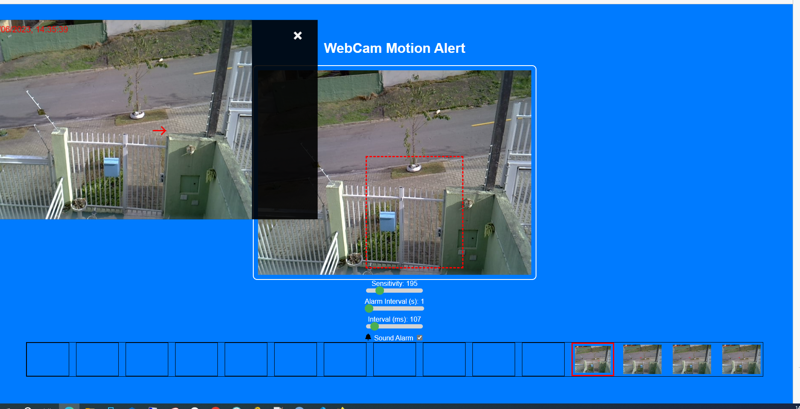

# Webcam Surveillance System

This project is a simple surveillance system that uses a webcam to detect movements. It has added a few new features to improve user experience and functionality.

## Prerequisites

- Python
- Pip


First, you need to install Python in your system. After installing Python, you can create a Python virtual environment and install Flask in it. Here are the steps:


1. Download the project to a folder on yout environment and run the `install.bat` file in your terminal to create the Python virtual environment and install Flask. The `install.bat` file should contain the following commands:

    ```bat
    @echo off
    IF NOT EXIST myenv (
      python -m venv myenv
    )
    call myenv\Scripts\activate
    pip install flask
    pip install flask_paginate
    ```

2. Run the `run_server.bat` file to start the Flask server. The `run_server.bat` file should contain the following commands:

    ```bat
    @echo off
    call myenv\Scripts\activate
    start /b python app.py
    timeout /t 5
    start http://localhost:8000/
    ```

## Features

- Detects movement within a selected area of the webcam video.
- Sounds an alarm if motion is detected.
- Allows adjustment of the motion detection sensitivity.
- Allows adjustment of the alarm interval (the duration between consecutive alarms).
- Allows adjustment of the motion check interval.
- Saves the settings and the selected area across sessions using localStorage.
- Upload image of moviment detection to server on snapshots folder
- you can see the captured images on another device on `http://localhost:8000/snapshots` (change localhost with your server name)
- You can use services like Heroku, PythonAnywhere, Google Cloud, Amazon AWS, Microsoft Azur and many others tho host your application


## Updated Features

- **Zoomed Snapshot Preview**: Implemented a snapshot modal that provides a zoomed-in view of selected snapshots for clearer examination. The selected snapshot will be outlined with a red border. The zoomed snapshot can be moved around by clicking and dragging.
- **Snapshot Navigation**: Users can navigate through the snapshots within the zoomed view using point and click on snapshot.
- **Motion Detection Indicator**: Now, the first point of detected motion will be indicated with a red arrow, making it easier to identify where motion was first observed.
- **Full-Screen Mode**: This system now allows you to go into full-screen mode by pressing 'F'. This is particularly useful for better monitoring or when viewing on larger screens. Press 'Esc' to exit full-screen mode.
- **User-Friendly Settings Interface**: The interface has been redesigned to be more intuitive, providing sliders for settings adjustment. These include sensitivity, alarm interval, and motion check interval.
- **Preservation of User Preferences**: The system will now remember user preferences even after a browser refresh. It uses local storage to save settings such as alarm intervals, sensitivity, and area of focus.


## Usage

1. After starting the Flask server, open the camera.html file in your browser. The other files should be in the same directory.
2. Allow the browser to access your webcam.
3. Select an area in the webcam video to monitor for motion.
4. Adjust the sensitivity, the alarm interval, and the check interval as needed.
5. If the system detects movement in the selected area, it will sound an alarm and create a snapshot.
6. Click on the snapshot thumbnail at the bottom to view a zoomed-in version. 
7. Press 'F' to go into full-screen mode and 'Esc' to exit.
8. You can view the snapshots at `http://localhost:8000/snapshots`.
9. Click on the snapshot thumbnail at the bottom to view a zoomed-in version. Navigate using arrow keys.




## Settings

- **Sensitivity**: Adjusts how much movement is necessary to trigger an alarm.
- **Alarm Interval**: Determines how much time must pass between consecutive alarms.
- **Motion Check Interval**: Defines how often the system checks for motion.
- **Silent mode**: Disable the sound triggered on motion detection

## Development

This project is developed with HTML, CSS, JavaScript, Python, and Flask.

## Contributions

Contributions are welcome! Please fork this repository and create a Pull Request if you have any improvements to suggest.
